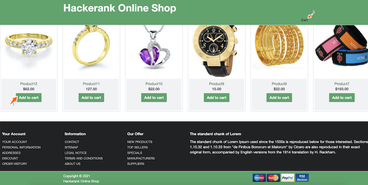
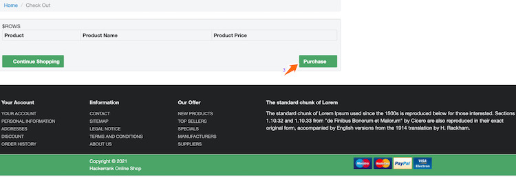
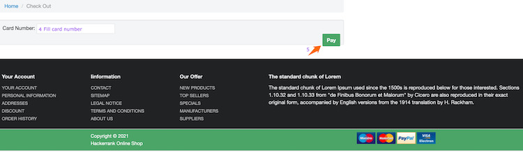

## Environment:
- Java version: 17
- Maven version: 3.*
- Selenium HtmlUnitDriver: 2.52.0

## Read-Only Files:
- src/test/*
- website/*
- src/main/java/com/hackerrank/selenium/server/*

## Requirements:
In this challenge, you are going to use selenium web driver, the HtmlUnitDriver, which uses HtmlUnit headless browser. So you neither need to setup the browsers like Firefox, Chrome nor a web driver executables like FirefoxDriver, ChromeDriver.
You are given a dummy online shopping website which displays item grid with item details. The given project lacks a few implementations and you have to complete the them.

There is a class `com.hackerrank.selenium.PurchaseAutomation.java` which has 2 methods:
 
`void makePurchase(String itemsURL, String itemName, WebDriver driver)`:
  - browser the items page.
  - select the item `itemName`.
  - add it to cart.
  - go to cart.
  - make purchase with a click on purchase button.
  
`void makePayment(String paymentURL, Card card)`:
  - fill the card number using the `card`.
  - make payment by clicking on pay button.
  - return the server response as a string.
  
There is a class `com.hackerrank.selenium.db.Database.java` which has a method:

`void selectValidCards()`:
Here we are using SQLite database and a method is given to connect to the database. The model class `Card.java` is provided which represents the `cards` table.
Example of item data:
| number | status |
|----------|-------|
| CD78844 | valid |
| 0495959 | invalid |

- this needs to return all the cards from the table `cards`.

There are tests for testing correctness of each methods. So you can make use of these tests while debugging/checking your implementation.
The example website is given in the `website` folder where you can view the structure of items page and cart page or you can run the `AppMain` class and browser the sample website to see the structure.

The items page will look like: 



The cart page will look like:



And the payment page will look like:



Your task is to complete the implementation of those 3 methods so that the unit tests pass while running the tests.

## Commands
- run: 
```bash
mvn clean package -DskipTests && java -jar target/selenium-java-purchase-automation-1.0.jar
```
- install: 
```bash
mvn clean install
```
- test: 
```bash
mvn clean test
```